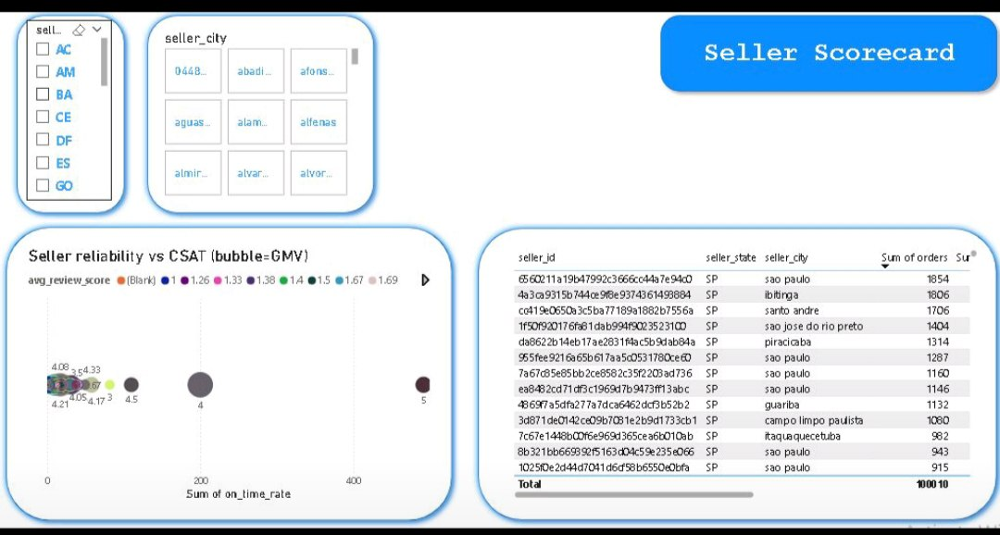

# 🛒 E-Commerce Delivery Analytics — dbt + PostgreSQL + Power BI

> **Business question:** How does delivery delay reduce review scores and repeat GMV?  
> Which seller / category / region is most at risk?


---

## 📌 Project Overview

End-to-end analytics engineering project on the **Olist Brazilian e-commerce** dataset.  
Pipeline: `raw → staging → marts → Power BI dashboard`




## Why this warehouse exists

Operational e-commerce data is not immediately reliable for business decisions.
This warehouse standardizes raw order, payment, review, product, and seller data into trusted marts for CX, growth, and repeat revenue analysis.
The goal is to make delay impact measurable and decision-ready across regions, sellers, and product categories.

---
**Decision use-cases:**
- Seller policy & SLA enforcement (delay → low review → churn)
- Logistics & ETA tuning by region (state/city)
- Category packaging standards

---

## 🏗️ Data Architecture
```
Raw (PostgreSQL)
    └── Staging (stg_*)          — cleaned, typed, renamed
         └── Marts (mart_*)      — business-ready aggregations
              └── Power BI       — executive dashboards
```

### Data Model

| Layer | Models |
|-------|--------|
| **Facts** | `fct_orders`, `fct_order_items`, `fct_reviews`, `fct_payments` |
| **Dims** | `dim_customer`, `dim_seller`, `dim_product`, `dim_geo` |
| **Marts** | `mart_growth_kpi`, `mart_growth_cohort_retention_monthly`, `mart_growth_funnel_daily`, `mart_growth_repeat_metrics`, `mart_growth_segments` |

---
## Core metric definitions

- GMV: Sum of approved payment values for valid orders
- Repeat GMV: GMV from customers with more than one completed order
- Delivered rate: Delivered orders / total valid orders
- Delay days: Actual delivery date - estimated delivery date
- CSAT proxy: Average review score
---
## Model grain

- fct_orders: one row per order
- fct_order_items: one row per order item
- fct_reviews: one row per review event
- mart_growth_funnel_daily: one row per date
- mart_growth_repeat_metrics: one row per cohort / segment / period (depending on model)
---
## Mart consumers

- mart_growth_kpi → executive KPI monitoring
- mart_growth_funnel_daily → growth / ops team
- mart_growth_repeat_metrics → CRM / retention analysis
- mart_growth_cohort_retention_monthly → lifecycle and retention review
- mart_growth_segments → customer mix and value segmentation
---

## 🔑 Key Findings

| Finding | Result |
|---------|--------|
| On-time delivery → avg review | **4.29 ⭐** |
| 6+ days late → avg review | **1.74 ⭐** (−2.55 pts) |
| Repeat rate on-time | **2.21%** |
| Repeat rate 6+ days late | **2.07%** (−0.14 pp) |
| Late deliveries share | **~6.8%** of orders |
| Seller on-time rate range | **0.88 – 0.96** |

**Top insights:**
-  Delay is the #1 CSAT killer — targeting the 6.8% late orders gives outsized impact
-  Geo hotspots: **RJ and BA** show higher delays vs SP; BA has highest avg distance
-  Some sellers have high on-time BUT low reviews → packaging/product quality issue

---

## 📊 Dashboard (Power BI)

| Page | Content |
|------|---------|
| Page 1 | Executive summary — GMV, orders, CSAT |
| Page 2 | CX Impact curve — delay days vs review score |
| Page 3 | Seller scorecard + drill-through |

### Dashboard evidence

1. Executive Summary — overall GMV, orders, CSAT trend
2. CX Impact Curve — how increasing delay days correlate with weaker reviews
3. Seller Scorecard — identify sellers with both volume and delivery-risk exposure

📁 Screenshots: [`/screenshots/`](./screenshots/)  
📄 Report spec: [`/dashboard/powerbi/report_spec.md`](./dashboard/powerbi/report_spec.md)

---
## Recommended actions

- Prioritize SLA monitoring for high-volume sellers with repeated delay exposure
- Review ETA and packaging rules in categories with strong delay-to-review sensitivity
- Segment regions where logistics delays disproportionately affect repeat purchase behavior

## ⚙️ How to Run

### Prerequisites
- PostgreSQL 13+
- dbt Core (`pip install dbt-postgres`)

### Setup
```bash
# 1. Clone the repo
git clone https://github.com/farrux05-ai/ae-ecommerce-warehouse
cd ae-ecommerce-warehouse

# 2. Configure database connection
cp profiles.yml.example ~/.dbt/profiles.yml
# Edit with your PostgreSQL credentials

# 3. Run dbt
dbt deps
dbt run
dbt test
```

### Run specific layers
```bash
dbt run --select staging.*     # only staging
dbt run --select marts.*       # only marts
dbt test --select fct_orders   # test specific model
```

---

## 📁 Project Structure
```
ae-ecommerce-warehouse/
├── models/
│   ├── staging/          # stg_* models — raw cleaning
│   ├── marts/            # mart_* — business aggregations
│   └── schema.yml        # tests & documentation
├── dashboard/
│   └── powerbi/          # .pbix file + report spec
├── docs/
│   └── metrics.md        # metric definitions
├── screenshots/          # dashboard screenshots
└── README.md
```

---

## 🛠️ Tech Stack

| Tool | Purpose |
|------|---------|
| PostgreSQL | Data warehouse |
| dbt Core | Transformation & testing |
| Power BI | Visualization |
| SQL | Core logic |

---

## 👤 Author

**Farrux Valijonov** — Analytics Engineer  
[](https://www.linkedin.com/in/farrux-valijonov)
[](https://github.com/farrux05-ai)
